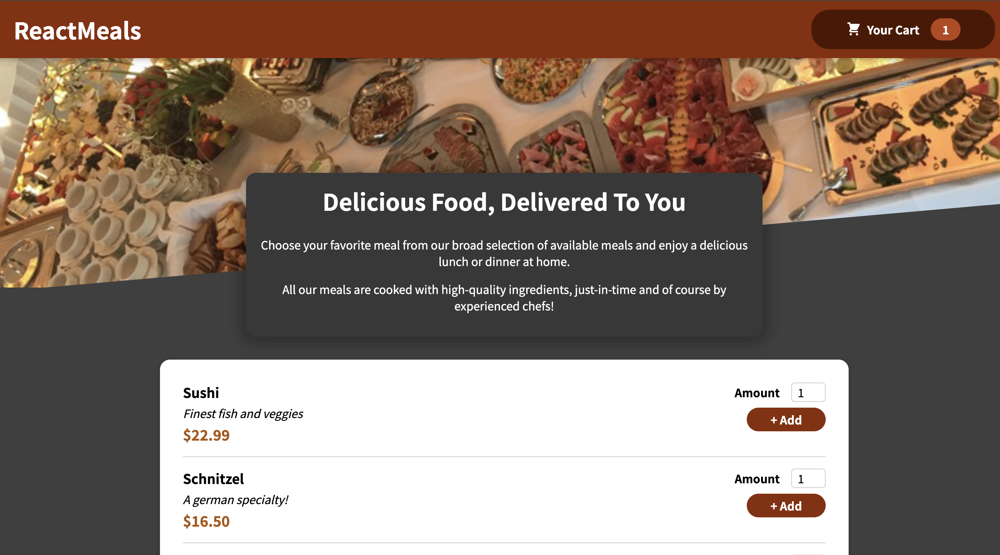
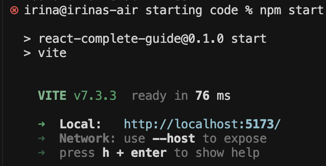
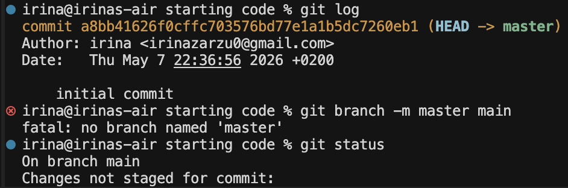
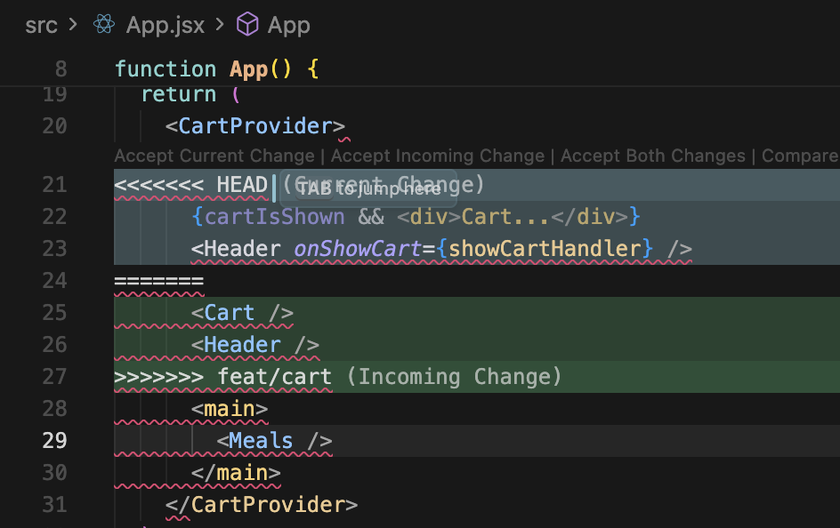
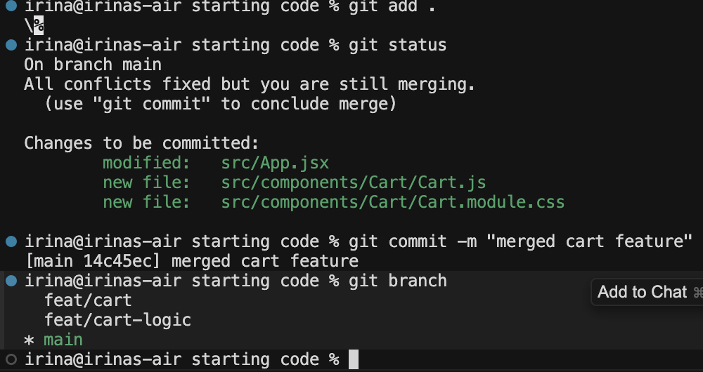

# React Food Order App

A small React food ordering app built while practicing Git and GitHub workflows. The app includes a meals list, cart state management, a cart modal, and controls for adding or removing meal items.

This project was created as part of the **Git and GitHub - A Practical Guide** course by *Academind*. I used it to better understand how Git works under the hood, in real project scenarios, from local repository basics to collaboration workflows on GitHub.

## Tech Stack

- React
- Vite
- CSS Modules
- Git and GitHub

## Getting Started

Install the dependencies:

```bash
npm install
```

Start the development server:

```bash
npm start
```

Build the project:

```bash
npm run build
```

## Features

- Display available meals.
- Add meals to the cart with a selected amount.
- Show the total number of cart items in the header.
- Open and close the cart modal.
- Increase or decrease item quantities inside the cart.
- Show the total cart amount.

## Screenshots

### App Home Page



### Starting the Development Server



## Git and GitHub Practice

This repository was mainly used to understand the Git workflows.

During the course, I went deeper into:

- Command line basics for macOS and Windows.
- Git installation and setup.
- Git theory: working directory, staging area, index, and repository.
- Creating local repositories.
- Working with commits and commit history.
- Understanding branches, `HEAD`, and detached `HEAD`.
- Using newer Git commands introduced around Git 2.23, such as `git switch` and `git restore`.
- Deleting staged and unstaged changes, commits, and branches.
- Ignoring files with `.gitignore`.
- Saving temporary work with the stash.
- Merging, rebasing, and cherry-picking.
- Recovering deleted data with the reflog.
- Connecting local repositories to remote GitHub repositories.
- Using `git push`, `git pull`, and `git fetch`.
- Understanding local branches, remote branches, and remote-tracking branches.
- Working with GitHub collaborators and contributors.
- Practicing forks and pull requests.
- Exploring GitHub Issues and GitHub Projects.

Some of the commands and concepts:

```bash
git init
git add .
git commit -m "initial commit"
git branch -m master main
git remote add origin https://github.com/IrinaZarzu/reactjs-food-order.git
git push origin main
```



The repository includes examples of working with branches, pushing changes to GitHub, merging work from different branches, and resolving conflicts.

## Branching Workflow

I created separate feature branches to improve the application:

- `feat/cart-logic` for the cart visibility and state logic.
- `feat/cart` for the cart modal UI.
- `feat/cart-button` for a small cart button improvement.


Example workflow:

```bash
git checkout -b feat/cart-logic
git add .
git commit -m "added cart visibility state"
git push origin feat/cart-logic
```

Feature branches were merged back into `main`:

```bash
git switch main
git merge feat/cart-logic
git merge feat/cart
```

During the merge process, I resolved a conflict in `App.jsx`, committed the merge, and pushed the final result to GitHub.





## Pull Request Practice

The project also includes a fork-based workflow:

1. Fork the repository from another GitHub account.
2. Clone the fork locally.
3. Create a feature branch.
4. Make a small improvement.
5. Push the branch with an upstream remote.
6. Open a pull request.
7. Review and approve the pull request.
8. Pull the merged changes back into the local `main` branch.

The small improvement was adding `type="button"` to the cart action buttons so they do not accidentally behave like submit buttons if the modal is later used near a form.

## What I Learned

Through this project, I practiced and understood how to move changes between local branches and GitHub, how to handle merge conflicts, and how upstream branches connect local work with remote branches.

This helped me become more comfortable with Git concepts such as the working directory, staging area, repository history, `HEAD`, detached `HEAD`, remotes, branch tracking, fast-forward merges, merge commits, rebasing, cherry-picking, stashing, reflog recovery, pull requests, forks, GitHub Issues, and GitHub Projects.